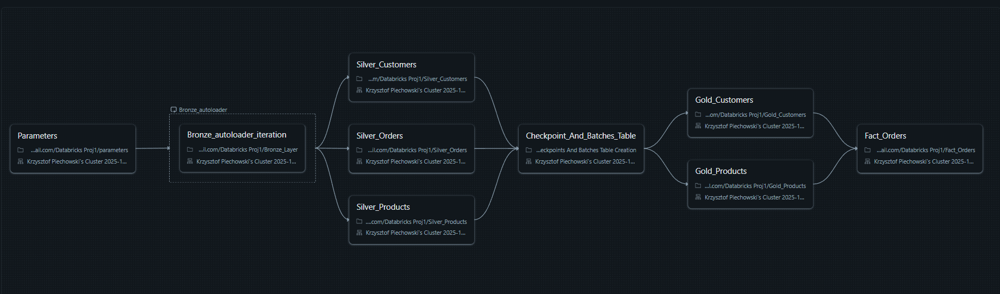

# Databricks Medallion ETL

End-to-end ETL pipeline built on **Azure Databricks** following the **Medallion Architecture (Bronze–Silver–Gold)** pattern.
The project demonstrates a modular data ingestion and transformation workflow using **Delta Lake**, **Auto Loader**, **Azure Data Lake Storage**, and **Unity Catalog** for governance.

---

## 🏗️ Architecture Overview



The pipeline follows the Medallion design:

* **Bronze layer:** Raw data ingestion (streaming or batch) directly from Azure Data Lake.
* **Silver layer:** Data cleaning, standardization, and schema enforcement.
* **Gold layer:** Aggregated and business-ready data for analytics or reporting.

Each layer is stored in a separate **ADLS container** to ensure physical separation of data and clear data lifecycle management.

---

## 🗂️ Unity Catalog Integration

This project uses **Azure Databricks Unity Catalog** for centralized governance, metadata, and schema management, while maintaining separate **Azure Data Lake Storage (ADLS)** containers for each Medallion layer.

* **Data Storage:**
  Each layer (Bronze, Silver, Gold) resides in a dedicated ADLS container:

  * `abfss://bronze@storageaccpiechk.dfs.core.windows.net/`
  * `abfss://silver@storageaccpiechk.dfs.core.windows.net/`
  * `abfss://gold@storageaccpiechk.dfs.core.windows.net/`

* **Unity Catalog Role:**
  Unity Catalog manages metadata and schemas for Delta tables that reference these external locations.
  It provides access control, lineage, and governance without physically storing the data.

> This architecture separates data storage from metadata governance, ensuring flexibility and security across layers.

---

## 📂 Notebook Workflow

The ETL process is divided into parameterized Databricks notebooks, executed sequentially as part of an orchestrated job.

| Notebook                                   | Description                                                                                                                          |
| ------------------------------------------ | ------------------------------------------------------------------------------------------------------------------------------------ |
| `0_parameters`                             | Defines dataset parameters (`orders`, `customers`, `products`) used to dynamically control the Bronze ingestion loop.                |
| `1_Bronze_Layer`                           | Reads raw data from the source container and writes to Bronze layer. Executed in a loop for each dataset defined in `parameters.py`. |
| `2_Silver_Customers`                       | Cleans and transforms the Bronze `customers` dataset.                                                                                |
| `3_Silver_Orders`                          | Cleans and standardizes the Bronze `orders` dataset with partitioning and ZORDER optimization.                                       |
| `4_Silver_Products`                        | Cleans and transforms the Bronze `products` dataset.                                                                                 |
| `5_Checkpoints And Batches Table Creation` | Manages Delta tables for tracking ingestion batches and checkpointing.                                                               |
| `6_Gold_Customers`                         | Builds SCD Type 2 dimension table (`DimCustomers`) with historical tracking and versioning.                                          |
| `7_Gold_Products`                          | Builds SCD Type 2 dimension table (`DimProducts`) with historical tracking and versioning.                                           |
| `8_Fact_Orders`                            | Builds the main fact table by joining dimensional tables, applying partitioning and optimization.                                    |

---

## ⚙️ Technologies Used

* **Azure Databricks** (PySpark, Delta Lake)
* **Azure Data Lake Storage (ADLS Gen2)**
* **Databricks Auto Loader**
* **Unity Catalog** (governance & metadata)
* **Python 3 / Spark Structured Streaming**
* **Medallion Architecture (Bronze–Silver–Gold)**
* **Delta Change Data Feed (CDF)** for incremental processing

---

## 🚀 Pipeline Workflow

1. **Parameter definition:**
   Dataset names and configurations for Bronze Layer Auto Loader are defined in `parameters.py`.

2. **Bronze ingestion:**
   Data is ingested from ADLS containers via Databricks Auto Loader:

   ```python
   df = spark.readStream.format("cloudFiles") \
       .option("cloudFiles.format", "parquet") \
       .option("cloudFiles.schemaLocation",f"abfss://bronze@storageaccpiechk.dfs.core.windows.net/checkpoint_{source_file_name}") \
       .load(f"abfss://source@storageaccount.dfs.core.windows.net/{source_file_name}")
   ```

   The Bronze notebook is executed in a loop for each dataset defined in parameters.

3. **Silver transformation:**
   Data cleaning, normalization, and schema enforcement for each entity with partitioning and optimization applied.

4. **Gold aggregation:**
   Curated data aggregation, creation of fact and dimension tables, and incremental updates via Delta CDF.

---

## 🧱 Advanced Features

* **SCD Type 2 Implementation:**
  Gold dimension tables (`DimCustomers`, `DimProducts`) maintain full change history using the SCD Type 2 pattern implemented with Delta Change Data Feed (CDF) and merge-based upserts.

* **Physical Partitioning and Optimization:**
  Silver and Gold fact tables are physically partitioned by time attributes (`year`, `month`) and optimized with ZORDER indexing.
  Additional tuning includes:

  * `OptimizeWrite` and `AutoCompact` enabled
  * Dynamic partition pruning
  * Broadcast joins for dimensional lookups
  * Target Delta file size configuration

---

## 🧩 Setup & Deployment

1. Clone this repository:

   ```bash
   git clone https://github.com/krzysztof-piechowski/databricks-etl-pipeline.git
   ```

2. Upload `.py` files or notebooks to Azure Databricks workspace.

3. Configure ADLS access (mount or ABFS path) and Unity Catalog catalog/schema.

4. Run the notebooks sequentially or as part of a Databricks Job pipeline.

---

## 📈 Future Improvements

* Integrate **Delta Live Tables** or Databricks Workflows for orchestration.
* Add data quality checks using **Great Expectations** or **Deequ**.
* Implement CI/CD deployment with **Azure DevOps** or **GitHub Actions**.
* Introduce monitoring and alerting via **Azure Monitor**.

---

## 📚 Author

**[Krzysztof Piechowski]**
Data Engineer | Azure | Databricks | ETL | Delta Lake
[LinkedIn](https://linkedin.com/in/krzysztof-piechowski) • [GitHub](https://github.com/krzysztof-piechowski)

---

> This project showcases a modern ETL pipeline using Databricks, ADLS, and Unity Catalog in the Medallion Architecture pattern, with SCD Type 2 and advanced Delta Lake optimizations.
